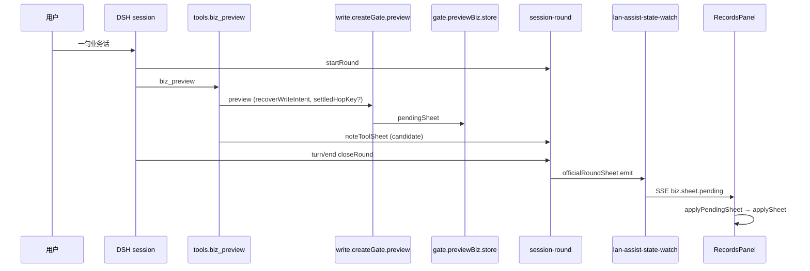

---
cursor:
  subagentId: "bc-9b8e4e07-3b9c-5959-8a40-d733675be2c2"
---

# 一句业务话 → 闸 → 业务记录右栏（现网代码路径）

仓库：`losebird/fde-x-desktop`（本机 `scene-39-personal-workstation`）。DSH 家目录：`~/.dsh-fde-x`（`FDE_DSH_HOME`）。只描述 HEAD 上已存在的调用链，不含改造建议。

---

## 1. 步骤链（用户句 → 右栏）

### 1.1 共用：话进会话、开回合

| 步 | 位置 | 做什么 |
|---|---|---|
| A | DSH `sessions` 插件 | 用户发一句 → `session/event` |
| B | `runtime/vendor-overlays/dsh-lan-assist/index.js` | `extractUserSpeech` → `rememberUserSpeech`（`slots.js`）→ `sessionRounds.noteHumanUtterance` + `startRound` |
| C | 同文件 `turn/start` | `sessionRounds.startRound(sessionId, { followup })`（写后跟进回合带 `wroteFollowup`） |
| D | 模型调工具 | `runtime/vendor-overlays/dsh-lan-assist/tools.js` `biz_preview.execute`：`lastUserSpeech` 补 `speech` → `secretary.previewBiz` |

`biz_preview` 返回前必走：`sessionRounds.noteToolSheet(sessionId, sheet)`（同文件 `registerTools` 传入的 `rounds.noteToolSheet`）。

### 1.2 闸内：previewBiz → 写闸 preview

| 步 | 位置 | 做什么 |
|---|---|---|
| E | `index.js` 包一层 `secretary.previewBiz` | 写后跟进且动作为 `现查` 时 `stampWroteLookup` + `lookupLocked` |
| F | `runtime/vendor-overlays/dsh-lan-assist/gate.js` `previewBiz` | 命中 `pendingSheet` 多选行时合并 `picked` / `patch`；否则原样 `incoming` |
| G | `gate.js` → `opts.gate.preview` | 即 `write.js` `createGate()` 的 `preview(spec)`（`index.js` 里 `const gate = createGate({...})` 注入 secretary） |
| H | `write.js` `preview` | 见下节分叉；成功/失败 sheet 经 `packSheet` / `sheet()` 回到 F |
| I | `gate.js` `previewBiz` 写 `store` | **现查 / 等号 / 多选等待**：`s.pendingSheet = incoming`，清 `pendingWrite`（约 308–334 行）。**过审 / 改行 / 删除 / 新建（有 preview_id）**：`stashListBeforeWrite` → `s.pendingSheet` + `s.pendingWrite` 令牌栈（约 336–418 行） |
| J | `session-round.js` `noteToolSheet` | 回合内只记 `candidate` / `weak`，**不**对外 SSE；leftover 分支见 1.6 |

### 1.3 分叉：现查（含结算后第二枪）

在 `write.js` `createGate().preview` 内顺序固定：

1. **`recoverWriteIntent(spec, vocab, enrichExtra)`**（`slots.js`）— 无写 role 或 look∧write 冲突时强制 `action: '现查'`；有唯一口语写动作且 `can` 含该动作 → 保留过审/改行/删除/新建。
2. **`enrichStructuredSlots` → `normalizePlan(plan)`** — hop / where / steps。
3. **结算键命中（第二枪，不再打连接器）**  
   - 键：`query-settle.mjs` **`settledHopKey`**（`sessionId` + `workspace` + JSON `{ speech, targetKind, page }`）。  
   - 条件：`plan.action === '现查'` 且非 `picked`、非 `replay`。  
   - 命中：`settledQueries.get(settledKey)` 且 `previewSettledLookup(cached)` → **`materializeSettledRepeat(cached)`**（工具结果带 `error: 'QUERY_SETTLED'` / `querySettledRepeat`）。  
   - 首次成功现查且 `previewSettledLookup(result)` → **`settledQueries.set(settledKey, result)`**（约 1728–1745 行）。
4. **`previewStructured(plan, enriched, loaded)`** — 连接器现查；成功 sheet 带 **`querySettled: true`**（多处 `settledList`，如 954、1148 行一带）。
5. 回到 **`gate.js` `previewBiz`**：现查/NOT_FOUND/ambiguous 且无 preview_id → 写 **`pendingSheet`**（过程表，回合未结束也可被 `/state` 读到）。

**`tools.js`**：`noteToolSheet` 若返回 `settledRepeatFrom` → 工具 JSON 用 `materializeSettledRepeat`；若 `outcome.cancel` → **`scheduleLeftoverCancel`**（见 1.6）。

### 1.4 分叉：过审 / 改行 / 删除 / 新建（写预览）

仍在 `write.js` `preview` / `previewStructured`：

- **`recoverWriteIntent`** 已把口语动作落到 `plan.action`（或与模型槽冲突时 `askAction` + 仍走现查）。
- 单行：发 **`preview_id`** 令牌（`tokens.set`，约 1515–1532 行）。
- **批量**：where 过滤后 `hitRows.length > BATCH_LIMIT` → **`refuse('TOO_MANY', ...)`**（约 1460–1463 行），`ok: false`，**无** `previewSettled`。
- **UNBOUND / NO_PATCH / blockConfirm**：`ok: false` 或 `preview_id: ''` 的「半预览」sheet。

**`gate.js` `previewBiz`** 写路径：`stashListBeforeWrite(s, prevSheet)` 把上一张 **现查列表** 存进 **`listBeforeWrite`**，再 **`s.pendingSheet`** 镜像写预览行。

### 1.5 分叉：失败 TOO_MANY（右栏不上台）

| 步 | 行为 |
|---|---|
| 写闸 | `write.js` 返回 `{ ok: false, error: 'TOO_MANY', ... }` |
| 回合 | `session-round.js` `isEligibleRoundSheet` → false → **不进 `candidate`** |
| 前端缓存 | `src/lib/biz-pending-stage.ts` **`isFailedRoundEndSheet`** / **`shouldStageRoundEndPending`** → false |
| 右栏 | `RecordsPanel.tsx` **`applyPendingSheet`** 首行 `shouldStageRoundEndPending` → false；**`rememberBizPendingSheet`**（`biz-session-sheet.ts`）同样拒收 |

### 1.6 分叉：结算后 leftover / cancel

| 触发 | 位置 | 结果 |
|---|---|---|
| 同 hop 再 `biz_preview`（已 `querySettled`） | `write.js` 缓存 或 `noteToolSheet` → `isSettledQueryRepeatLeftover` | `closeRound(..., 'leftover')` + **`cancel: true`** |
| 现查 leftover 盖住写预览 | `session-round.js` `isLeftoverAfterCandidate` / `leftoverQueryCoveringWrite` | 同上 |
| 已结算后再 `search_text` | `index.js` `tool/call` → **`notePostSettledHopTool`** | leftover + **`cancelLeftover`** |
| 取消时机 | `tools.js` **`scheduleLeftoverCancel`** → `index.js` **`tool/result`** → **`flushLeftoverCancel`** → **`agent.cancel({ kind: 'plugin-leftover' })`** | 停工具环，**不**改 `pendingSheet` 权威 |

### 1.7 回合结束 → SSE → 右栏

| 步 | 位置 | 做什么 |
|---|---|---|
| K | `index.js` `turn/end` | **`sessionRounds.closeRound(sessionId)`**：`candidate` → **`round.official`**；若 `official && !handed` → **`emit: true`**，并 **`handed = true`** |
| L | `index.js` `attachOfficial` | `/state` 的 **`officialRoundSheet`** = **`sessionRounds.servedSheet(sid)`**（开回合中可先暴露 **`candidate`**；**`kindFocus`** 优先，见 focus） |
| M | `runtime/lan-assist-state-watch.mjs` | 每秒 `lanAssist('/state')` → **`officialFromState`**（`officialRoundSheet` + **`writePreview`** 投影）→ **`emitBizSheetPending(..., source: 'round-end')`** |
| N | `runtime/routes/biz.mjs` **`emitBizSheetPending`** | SSE **`biz.sheet.pending`** + 更新 BFF 内存 **`lastEmittedPendingBySession`** |
| O | `RecordsPanel.tsx` | **`useEvents(['biz.sheet.pending'])`**（忽略 `source === 'lan-assist'` 的旧源）；**`shouldStageRoundEndPending`** → **`rememberBizPendingSheet`** → **`applyPendingSheet`** → **`applySheet`** 填 **`rows` / `columns` / `listSheetMeta`** |

**右栏手点预览**（非模型工具）：`POST /api/v1/biz/preview` → `aiRuntime.lanAssist('/preview')` → **`recordSurfaceFromPreview`** → 同样 **`emitBizSheetPending`**（source 多为 `ui` / `bff`），不经过 `turn/end` 也可推 SSE。

**写确认过账**：`biz_write` → `gate.js` `commitWrite` → 连接器；`closeRound(..., 'wrote')` 不立刻换官方表；跟进现查走 E 的 `lookupLocked`。

---

## 2. 「表」权威：谁写、谁读、谁能盖谁

| 名字 | 存哪 | 谁写 | 谁读 | 覆盖关系（现网） |
|---|---|---|---|---|
| **`pendingSheet`** | DSH lan-assist **`store`**（`gate.js` `previewBiz` / `dismissWrite` / `backSheet`） | 每次 **`previewBiz`** 成功路径；写预览时 **`stashListBeforeWrite`** 前先保留现查 | BFF **`GET /api/v1/biz/pending-sheet`** 在 **`official` 为空** 时用 **`state.pendingSheet`**（`biz.mjs` 924–927）；**`emitBizSheetPending`** 的 **`hallSheet`** 防盖（`shouldSkipCoveringPending(hall, normalized)`） | 新 **`previewBiz`** 可换整张（`shouldKeepPopulatedListSheet` 等_guard）；**`dismissWrite`** 可 **`listBeforeWrite`** 还原现查并清 preview_id |
| **`officialRoundSheet`** | 内存 **`sessionRounds`**（`session-round.js` `round.official`） | **`closeRound`** 把 **`candidate`** 升格；**`handed`** 控制是否再 emit | **`attachOfficial`** → `/state`；**`lan-assist-state-watch`**；GET pending 主路径 **`sheetForOfficialGet`**（`connected-kind.mjs`） | 新 utterance **`startRound`** 不删旧 official，直到 **`closeRound`** 用新 **`candidate`** 替换；**`roundOfficialKey` 变** 时 **`handed=false`** 可再 emit |
| **`lastEmitted`** | BFF **`lastEmittedPendingBySession`**（`biz.mjs`） | 每次成功 **`emitBizSheetPending`** | GET **`sheetForOfficialGet` / `sheetForPendingGet`**；emit 前 **`shouldSkipCoveringPending(lastEmitted, incoming)`** | 弱于「不应盖」的 hall/official 规则；**`force: true`**（focus-kind）可无视 skip |
| **`handed`** | `session-round.js` **`round.handed`** | **`closeRound`** 在 **`emit`** 后置 true；official key 变则 false | 决定是否 **`closeRound` 再推 SSE** | 只挡重复 **round-end emit**，不挡 **`pendingSheet`** 过程写入 |
| **`listBeforeWrite`** | **`store.listBeforeWrite`** | **`gate.js` `stashListBeforeWrite`**（写预览进厅前，上一张有行的现查） | **`dismissWrite`** 撤写预览时还原 **`pendingSheet`** | 仅一份；已有则不再 stash |
| **SSE `biz.sheet.pending`** | 事件总线 payload + **`payload.sheet`** | **`emitBizSheetPending`**：round-end 轮询、UI preview、**`focus-kind`** | **`RecordsPanel`**、**`biz-records-auto-open.ts`** | 前端 **`shouldSkipCoveringPending`** / **`shouldStageRoundEndPending`** / history pin 可拒画；**dismissed preview_id** 在 BFF **`isBizPreviewDismissed`** 拒 emit |
| **GET pending** | HTTP 聚合 | BFF 读 **`officialRoundSheet` + writePreview + lastEmitted + pendingSheet 回退** | **`hydrateFromPending`**、会话切换 effect | **`sheetForOfficialGet`**：已结算现查 official 优先于 human write **`lastEmitted`**；无 official 则 **`sheetForPendingGet(hall, lastEmitted)`** |
| **RecordsPanel 屏幕表** | React **`rows` / `columns` / `listSheetMeta` / `displayedSheetRef`** | **`applyPendingSheet` → `applySheet`**；型芯片 **`applyLocal` / `bizFocusKind`** | 用户所见表格 | **`shouldSkipCoveringPending(displayed, incoming)`**、**`shouldRejectIncomingCovering`**、**`shouldHoldSideKindView`** 可保留旧屏；**`peekActivePending`** 读 **`peekBizPendingSheet`**（内存，非 DSH） |
| **设置页 focus + 型芯片** | **`sessionRounds.kindFocus`** | 右栏型芯片 **`runtimeApi.bizFocusKind`** → **`POST /api/v1/biz/focus-kind`** → lan-assist **`focusOperationKind`** → **`materializeOperationKindSheet`** + **`focusKindSheet`** | **`servedSheet`**；BFF **`emitBizSheetPending(..., force: true)`** | **`kindFocus`** 盖 **`candidate`/official** 直到新 official 或新回合；**`CoreSettings.tsx`「重载核心」** 不直接改表，只重启运行时（见 §4） |

辅助投影：**`writePreview`** = `gate.previewTokenIndex()`（`index.js` `attachOfficial`），GET pending 与 state-watch 用 **`projectWriteConfirm(official, writePreview)`** 合并确认态，不单独占一栏。

---

## 3. 结算键、leftover cancel、recoverWriteIntent 卡在哪一步

| 机制 | 卡步 | 符号 / 文件 |
|---|---|---|
| **结算键** | 写闸 **`preview`** 在 **`previewStructured` 之前** | `query-settle.mjs` **`settledHopKey`**、`previewSettledLookup`、`materializeSettledRepeat`；`write.js` **`settledQueries`**（`createSettledQueryStore`） |
| **leftover cancel** | 工具 **`biz_preview` 返回后** 若 `noteToolSheet.cancel` | `tools.js` **`scheduleLeftoverCancel`** → `index.js` **`flushLeftoverCancel` / `cancelLeftover`**；判定在 **`session-round.js`** **`noteToolSheet` / `notePostSettledHopTool`** |
| **`recoverWriteIntent`** | 写闸 **`preview`** 内，**`pickHopSpeech` 之后、`enrichStructuredSlots` 之前** | `slots.js` **`recoverWriteIntent`**；`write.js` 约 1606–1632 行；写后跟进 **`lookupLocked`** 在 recover 之后强制 **`action: '现查'`** |

---

## 4. 重载核心 vs 浏览器刷新

| 动作 | 刷新什么 | 业务表路径影响 |
|---|---|---|
| **设置 → 重载核心**（`CoreSettings.tsx` → `runtimeApi.reloadAi` → **`POST /api/v1/ai/reload`**，`server.mjs` **`scheduleRuntimeRestart`**） | BFF 进程重启；**`dsh-core.mjs` `reloadInternal`** → stop/start DSH；**`ensureIsolatedProfile` → `applyVendorOverlay`** 把 `runtime/vendor-overlays/dsh-lan-assist` 覆盖到 **`~/.dsh-fde-x/vendor/dsh-lan-assist`** | DSH **store / sessionRounds** 随核心重启清空或重建；BFF **`lastEmittedPendingBySession`** 清空。**`lan-assist-state-watch`** 重新轮询 `/state` 再 emit。进行中的那句可能丢（重载代价，见 `docs/core-reload-dual-bff.md`） |
| **浏览器刷新（F5）** | Vite 前端整页重载 | **`biz-session-sheet.ts` `pendingBySession` 内存清空**；**`RecordsPanel`** `useEffect` → **`getBizPendingSheet`**（GET pending）+ **`hydrateFromPending`** 从 **DSH official / hall / BFF lastEmitted** 拉回；**不**重新拷贝 overlay（除非同时重载核心） |

---

## 5. 简图（口语现查 happy path）

---

*核对范围：overlay 源 `runtime/vendor-overlays/dsh-lan-assist/*`、BFF `runtime/routes/biz.mjs`、`runtime/lan-assist-state-watch.mjs`、前端 `src/components/biz/RecordsPanel.tsx` 与 `src/lib/biz-*`。*
