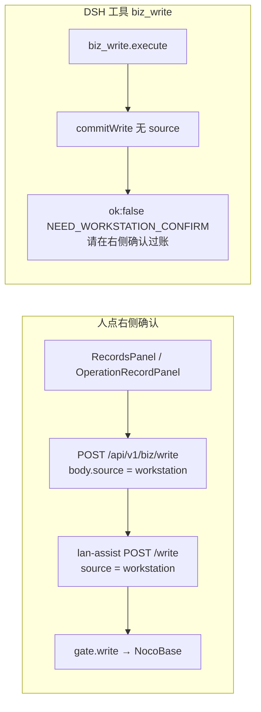

---
cursor:
  subagentId: "bc-3d51a5b6-9737-5d43-8de2-30313b00e37a"
---

# 过账安全：阻断模型 `biz_write` + 闸文案透传

## 改了哪些文件

| 文件 | 改动 |
|---|---|
| `runtime/vendor-overlays/dsh-lan-assist/gate.js` | `commitWrite` 仅当 `spec.source === 'workstation'` 才调 `gate.write`；否则 `NEED_WORKSTATION_CONFIRM` / hint「请在右侧确认过账」 |
| `runtime/vendor-overlays/dsh-lan-assist/tools.js` | **未改**（仍注册 `biz_write`，但执行会撞上上述闸） |
| `runtime/routes/biz.mjs` | `POST /api/v1/biz/write` 要求 `body.source === 'workstation'`；转发 `source` 到 lan-assist `/write`；`bizWriteFailureMessage` / `ok:false` 分支从 `lines[0].hint` 取文案 |
| `runtime/dsh-core.mjs` | `lanAssist` HTTP 4xx 时从 `payload.lines[].hint` 组装 `AiRemoteError.message`（不再只剩 `IM 调用失败：HTTP 400`） |
| `runtime/server.mjs` | `executeOperationLive` 的 `writePreview` 补 `source: 'workstation'`（人工审批执行仍可走闸） |
| `src/components/biz/RecordsPanel.tsx` | `confirmWrite` 失败：红条保留闸文案，并 dismiss pending、关抽屉、恢复列表 |
| `runtime/tests/biz.test.mjs` | 静态断言 workstation 闸与 lines hint 透传 |

## 怎么区分「确认写」和「模型写」

- **唯一写库口令**：请求体里的 `source: 'workstation'`（工作台 UI 与 BFF 已统一；模型工具不传该字段）。
- **BFF 双层**：无 `workstation` 直接 403「请在右侧确认过账」；有则带 `source` 进 lan-assist。
- **预览不受影响**：`biz_preview` / `POST /api/v1/biz/preview` 未改；仅 **commit 写** 要 workstation。

## 过期令牌红条

- 闸：`lines[0].error = EXPIRED`，`lines[0].hint = 预览过期了。要写再预览一次。`
- 经 BFF：`dsh-core` 把 hint 放进 `AiRemoteError.message` → `bizWriteFailureMessage` 直接返回 → `RecordsPanel.formatBizPanelError` 展示原文（不再统一 fallback）。

## 确认失败 UI

- `confirmWrite` catch：`dismissBizPreviewId` + `clearBizPendingSheet` + `setDrawer(null)` + `bizDismissPreview` + `restoreRecordsList`，右表不再显示可点「待确认」。

## 验证

- `node --test runtime/tests/biz.test.mjs`（12/12 通过）
