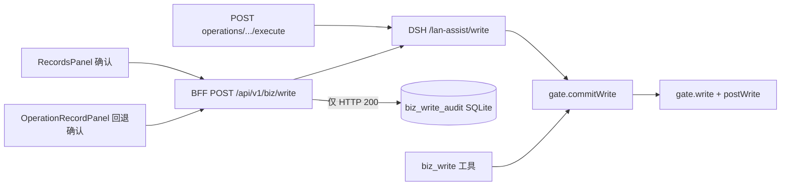

---
cursor:
  subagentId: "bc-27c775c5-8026-5a63-9744-f71146c10584"
---

# BFF / workstation 过账链 — 可复现洞（只查因）

对照：[增删改审手测集](../docs/biz-write-eval.md)、[W1 根因](../docs/biz-write-w1-root-cause.md)、闸/槽层 [write-audit-overlay.md](./write-audit-overlay.md)。  
**未改产品、未重启 4318、未点过账、未写业务库。** 本机 live 探测仅 `POST /api/v1/biz/write` + 假 `preview_id`。

## 链路与职责（第一性原理）

- **唯一写库口令（闸）：** `source === 'workstation'`（`gate.js` `commitWrite` → `gate.write`）。
- **BFF 第二层（磁盘代码）：** 无 `body.source=workstation` → **403**，不转发 lan-assist（`biz.mjs`）。
- **预览：** `biz_preview` / `POST /api/v1/biz/preview` 不过闸；令牌 TTL **90s**（`write.js` `PREVIEW_TTL_MS`）。

## Live 4318 与磁盘代码

| 项 | 证据 |
|---|---|
| 监听进程 | **PID 90180**，`node runtime/server.mjs`，启动 **2026-09-23 23:09:09** |
| 磁盘变更 | `runtime/routes/biz.mjs`、`runtime/dsh-core.mjs` mtime **2026-09-24 13:31**（commit `1bf8b675` 一带） |
| 结论 | **4318 仍是未重启的旧 BFF 内存镜像**；DSH lan-assist overlay 与磁盘一致（见 overlay 审计），形成 **闸已要求 workstation、BFF 未转发 source** 的割裂 |

**Live 探测（2026-09-24，假令牌 `pv_nonexistent_probe`）：**

| 请求体 | HTTP | `error.code` | `error.message` |
|---|---|---|---|
| 无 `source` | 400 | `NEED_WORKSTATION_CONFIRM` | 请在右侧确认过账 |
| `source: workstation` | 400 | `NEED_WORKSTATION_CONFIRM` | 请在右侧确认过账 |
| `source: ai` | 400 | `NEED_WORKSTATION_CONFIRM` | 请在右侧确认过账 |

磁盘新 BFF 预期：前两行第二种应进闸校验令牌（`NEED_PREVIEW` 等），第一种应 **403 `biz_write_forbidden`**。Live 三种同响应 → **旧 BFF 未带 `source` 调 lan-assist**（与 `git show 1bf8b675^:runtime/routes/biz.mjs` 一致）。

---

## 1. `POST /api/v1/biz/write`（磁盘语义 + live 偏差）

### 磁盘（当前仓库）

| 条件 | BFF 行为 | 用户可见（右栏 `formatBizPanelError`） |
|---|---|---|
| 缺 / 空 `preview_id` | 400 `validation_error` | 取决于 API 层文案 |
| `source` 非 `workstation`（含缺省、模型直打 BFF） | **403** `biz_write_forbidden`「请在右侧确认过账」 | 红条同上 |
| `source=workstation`，lan-assist 4xx / 抛错 | 400，`bizWriteFailureMessage`（`lines[0].hint` / EXPIRED 特例） | 闸 hint 或「预览过期了…」 |
| `source=workstation`，body `ok:false` 且仅 `lines[].hint` | 400，读 `lines[0].hint`（`biz.mjs` 1144–1160） | 同上 |
| 200 | `insertBizWriteAudit` + 200 | 成功 notice，关抽屉 |

转发 lan-assist body 含 `preview_id`、`trace_id`、**`source: writeSource`**、`workspace`（`biz.mjs` 1123–1130）。

### 模型 / 工具直打

| 路径 | `source` | 结果 |
|---|---|---|
| `biz_write` → `commitWrite(args)` | 无 | `NEED_WORKSTATION_CONFIRM`，hint「请在右侧确认过账」（`gate.js` 422–433，`tools.js` 262–264） |
|  curl / 脚本直打 BFF | 无 | 磁盘：**403**；**live 90180：400 NEED_WORKSTATION**（未走 BFF 403 分支） |

### 过期 preview（W1 类）

- 闸：`gate.write` `refuse('EXPIRED', '预览过期了。要写再预览一次。')`（`write.js` 1564–1565）。
- `commitWrite` 失败包：**无顶层 `hint`**，只有 `lines[].hint`（`gate.js` 468–476）。
- **旧** `dsh-core.mjs` `lanAssist`：4xx 时 `payload.hint || … || IM 调用失败：HTTP 400`（无 `lines` 解析）→ **旧** `bizWriteFailureMessage` 见 `IM 调用失败` 即 fallback（`biz.mjs` 51–57）→ 红条 **「过账失败，请重新预览后再试」**（W1 手测 + `internal/biz-write-w1.md`）。
- **磁盘新** `dsh-core.mjs` 905–916、`biz.mjs` 56–60：应从 `lines[0].hint` 透出 — **重启 BFF 后才生效**。

---

## 2. EXPIRED / NEED_WORKSTATION / `lines[].hint` → 泛化红条

| 洞 ID | 文件:行 | 触发条件 | 用户可见后果 |
|---|---|---|---|
| **BFF-1** | `runtime/dsh-core.mjs`（live 旧）≈905–907；`runtime/routes/biz.mjs` 51–57 | 预览 **>90s** 后右栏确认；lan-assist `/write` **HTTP 400**，body 仅 `lines[0].hint` | 红条 **「过账失败，请重新预览后再试」**，看不到「预览过期了…」；与 [W1 根因](../docs/biz-write-w1-root-cause.md) §1 一致 |
| **BFF-2** | `src/components/biz/RecordsPanel.tsx` 185–189 | `RuntimeApiError.message` 仍含 **「IM 调用失败」**（其它 IM 路径或异常拼接） | 同上 fallback，即使 BFF message 略好也会被 UI 吃掉 |
| **BFF-3** | `runtime/vendor-overlays/dsh-lan-assist/gate.js` 468–476 | 任意 `commitWrite` 失败且 hint 只在 `lines[]` | 依赖 BFF/`dsh-core` 解析 `lines`；否则落 BFF-1 |
| **BFF-4** | `git` 父提交 `biz.mjs` ok:false 分支（约 1138–1145） | 若 lan-assist 将来 **200 + ok:false**（当前 `http.js` 148 为 400）且仅 `lines[].hint` | 旧 BFF **不读 lines**，仅 `written.hint` → 仍可能泛化（磁盘已修 1144–1160） |

`NEED_WORKSTATION_CONFIRM` 在 `commitWrite` 时 **带顶层 `hint`**（`gate.js` 424–432），旧 `lanAssist` 常能显示「请在右侧确认过账」— **与 EXPIRED 不对称**。

---

## 3. `executeOperationLive` 与绕过右栏确认

| 洞 ID | 文件:行 | 触发条件 | 用户可见后果 |
|---|---|---|---|
| **BFF-5** | `runtime/server.mjs` 2427–2434；`runtime/db.mjs` 802–888 | 操作单 **live + approved**，`POST .../operations/:id/execute` | **不经过** RecordsPanel，但 `writePreview` **磁盘**已带 `source: 'workstation'`；**live 旧 server** 仅 `preview_id`+`trace_id` → 执行失败「请在右侧确认过账」类 |
| **BFF-6** | `runtime/db.mjs` 802–888（无 `insertBizWriteAudit`） | 上条路径执行 **成功** | 业务已写，**操作记录 / `biz_write_audit` 无对应 trace**（与 BFF 右栏成功不一致） |
| **BFF-7** | `runtime/vendor-overlays/dsh-lan-assist/tools.js` 250–264；`gate.js` 422–433 | 模型调 **`biz_write`**（无 `source`） | 工具 JSON 里拒写；**W1 时代**闸未卡时曾 **左栏直写库**（见 W1 表）；现 overlay 下应拒，但 **audit 仍不记** |
| **BFF-8** | `src/components/biz/RecordsPanel.tsx` 1691–1692；`OperationRecordPanel.tsx` 356–357 | 全仓库仅两处 `bizWrite(..., { source: 'workstation' })` | UI 无第二确认按钮；**不能**从 UI 故意去掉 source；绕过只能靠 **工具 / 旧 BFF+ forged 请求**（非产品按钮） |

---

## 4. `biz_write_audit` 记什么、漏什么

| 何时写入 | 字段来源 | 漏记 |
|---|---|---|
| **仅** BFF `POST /api/v1/biz/write` **200**（`biz.mjs` 1185–1199） | `trace_id`、`kind/action`（sheet/body/written）、`receipt_id`、`changes`/`columns`、`lookup_bind`、`source` | — |
| DSH `biz_write` 成功 | — | **整单缺失**（W1 receipt `388329877078016`） |
| `executeOperationLive` 成功 | — | **整单缺失** |
| BFF 失败 / 403 / 400 | — | 无行（预期） |

| 洞 ID | 文件:行 | 触发条件 | 用户可见后果 |
|---|---|---|---|
| **BFF-9** | `biz.mjs` 1195 | BFF 成功且 `body.source=workstation` 但 sheet 带 `sessionId` | `source` 落成 **`ai`**（`sheet?.sessionId ? 'ai' : 'workstation'`），操作记录来源 **误导** |
| **BFF-10** | `biz.mjs` 451–458 | `capturePendingSheet` 的 `preview_id` 与 body 不一致 | audit 仍可写，但 **kind/changes 靠 body**；body 不全时 **审计字段空/偏** |
| **BFF-11** | `db.mjs` 694–714 `ON CONFLICT(trace_id)` | 同 `trace_id` 二次 insert | **合并** receipt/kind，非 append-only；排障易以为「只写了一次」 |

---

## 5. Preview TTL 90s — 可复现分支

常量：`runtime/vendor-overlays/dsh-lan-assist/write.js` 19、`1098`/`1337`/`1371` 设 `expiresAt`。

| 场景 | 闸行为 | 右栏 / BFF（磁盘，BFF 已重启前提下） | live 90180 额外 |
|---|---|---|---|
| 预览后 **>90s** 再点确认 | `EXPIRED`（`write.js` 1565） | 应显示过期 hint（新 dsh-core） | **BFF-1** 泛化红条；且 **不转发 source** 时可能先 **NEED_WORKSTATION** |
| 过期后 **左栏再说话预览** | 新 `pv_*`、新 TTL | 新 pending / 抽屉（手测 W3/W9） | 同 |
| **同一 `preview_id` 成功后再点** | `USED`（`write.js` 1564） | hint「这张预览已经用过…」 | 若根本写不出去（BFF-12），用户只看到确认失败 |
| 过期后 **不重新预览**，左栏 `biz_write` 旧 id | `EXPIRED` | 工具明文 EXPIRED；右栏仍持旧 id 直到 dismiss | W1 Turn2 step2 |
| 右栏确认失败后（**新前端**） | — | `confirmWrite` catch：**关抽屉 + dismiss**（`RecordsPanel.tsx` 1707–1717） | 失败即 **丢「待确认」态**；与 W1「失败仍新建·待确认」不同 — **前后端版本不一致** |

---

## 6. `POST .../cancel` 与 `records-cancel`

| 层 | 磁盘 | live 90180 |
|---|---|---|
| `RecordsPanel.tsx` 965 | `cancelAi(sid, { kind: 'records-cancel' })` | 同（5174 前端为新） |
| `runtime-api.ts` 1083–1094 | body `{ kind }` | 同 |
| `server.mjs` 1794–1805 | 转发 `cancelBody.kind` → `session/cancel` | **旧：**仅 `{ sessionId }` |
| DSH `turn/end` | 应能区分 `records-cancel` / `plugin-leftover`（overlay 已修，见 [leftover-cancel-fix.md](./leftover-cancel-fix.md)） | **BFF 未转发 kind** → Harness 仍记 **`user` abort**（W1 §3、[tool-call-abort](../docs/tool-call-abort-root-cause.md)） |

| 洞 ID | 文件:行 | 触发条件 | 用户可见后果 |
|---|---|---|---|
| **BFF-12** | `server.mjs`（live 旧）1794–1800 vs 磁盘 1796–1801 | 右栏取消预览 / leftover 触发 `records-cancel` | 会话里 **tool call aborted**、turn **user** 中止 — **不是**用户点「停生成」 |
| **BFF-13** | `biz.mjs` 1089–1092 | `POST /api/v1/biz/preview/dismiss` | 走 `/write/cancel`，与 **AI cancel** 无关；勿与 BFF-12 混 |

---

## 7. Live 割裂：闸新 + BFF 旧（当前手测最致命）

| 洞 ID | 文件:行 | 触发条件 | 用户可见后果 |
|---|---|---|---|
| **BFF-14** | 旧 `biz.mjs` 写转发；`gate.js` 422–433 | **5174 新 UI** 带 `source: workstation` 点确认；**4318 未重启** | **一律**「请在右侧确认过账」/ `NEED_WORKSTATION_CONFIRM`，**右栏无法过账**（探测已证） |
| **BFF-15** | 同上 + `RecordsPanel.tsx` 1707–1717 | 在 BFF-14 下点确认 | 红条 + **抽屉被关、pending 清掉** — 预览态丢失，需 **重新预览**（仍可能写不出直到重启 BFF） |

**重启 BFF（未做）后** 应验证：BFF-1/14/15 是否消失，W1 类 EXPIRED 是否变为明确过期文案，W4/W10 可选过账是否只走右栏且 **audit 有 receipt**。

---

## 8. 与手测集映射（仅列 BFF/过账相关）

| 编号 | 相关洞 | 说明 |
|---|---|---|
| W1 / W4 | BFF-1、BFF-7、BFF-9、BFF-14 | 只预览却被模型写；右栏失败文案；audit 空 |
| W24–W25 | BFF-12、BFF-13 | 取消与 abort 记账混淆 |
| W29 | overlay + BFF-15 | 连续预览 pending 跟最新一跳；失败 dismiss 加剧状态跳变 |
| W30 | BFF-7、gate | 无令牌 / 模型写 — 闸拒；**live BFF-14** 是「有令牌也写不出」 |

---

## 9. 建议验证顺序（仍只读/假令牌）

1. 重启 **仅** `runtime/server.mjs`（用户未授权则跳过）后重跑 live 三体 `source` 探测。  
2. 用 **已过期** 已知 `preview_id`（W1 文档）打 BFF，核对 message 是否为「预览过期了…」。  
3. 成功过账后查 `runtime/data/fde-workstation.sqlite` `biz_write_audit` 与 NocoBase 行是否 **同源 trace**。

---

**关联内部文档：** [biz-write-w1.md](./biz-write-w1.md)、[block-model-write.md](./block-model-write.md)、[leftover-cancel-fix.md](./leftover-cancel-fix.md)、[write-audit-overlay.md](./write-audit-overlay.md)。
